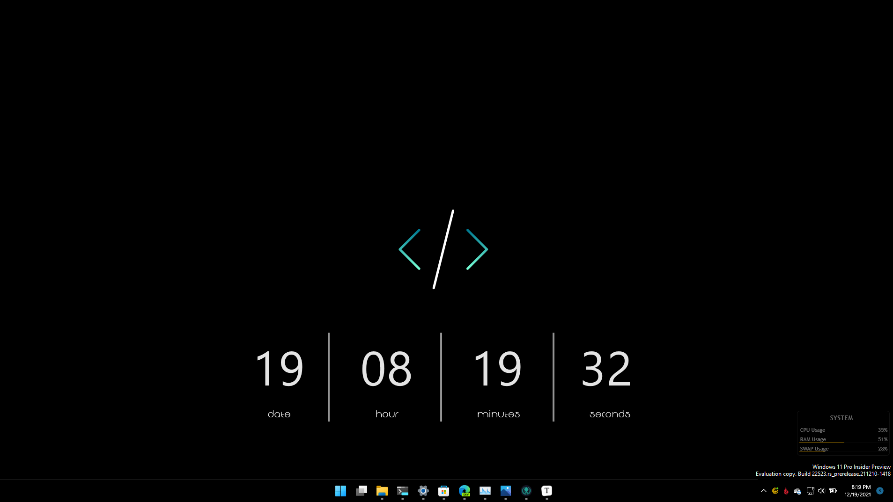

# Desktop Wallpapers

This repo simply houses/backs up my various desktop wallpapers (mostly windows specific) from over time.

See the [Changelog](CHANGELOG.md) for latest updates to the repo.

See my [Shell Specific Backgrounds](Terminal) for how I implement these into Windows Terminal.

## Structure

The directories are split out into:

- [Win11](Win11): Windows 11 specific wallpapers
- [Win10](Win10): Windows 10 and generic Windows Wallpapers
- [Latest](Latest): My Latest Wallpapers Used
- [ATL](ATL): Atlanta Skyline Wallpapers
- [Terminal](Terminal): Wallpapers and backgrounds used for various shells in my Terminal

## Current Wallpaper

My Current Wallpaper Setup is this:

*Credits to Rainmeter's Soonex Clock Skin for the Desktop Widget*

## Example Terminal Background

For example, for Kali Linux here's what it would look like:

***

Jimmy Briggs | 2022

